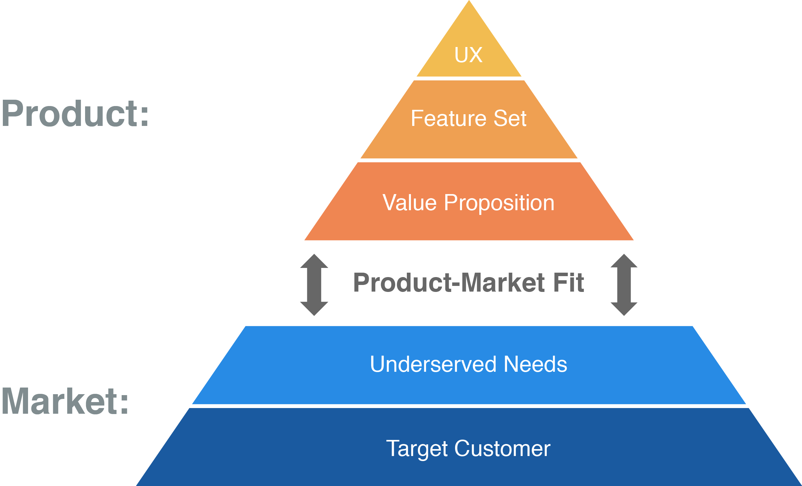
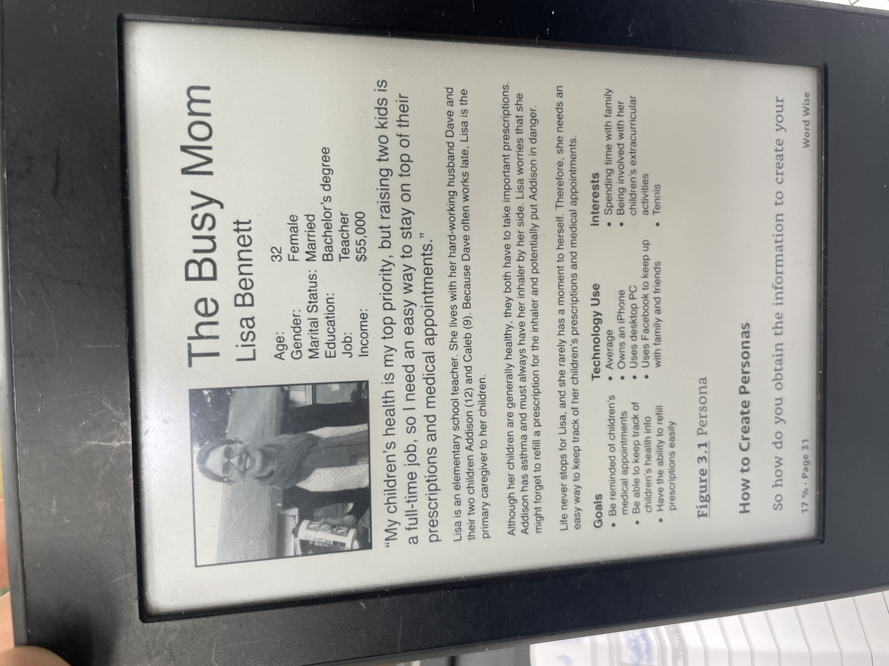

# Thomas Notes

## Table of Contents

- [Introduction](#introduction)
- [Chapter 3 - Determine Your Target Customer](#chapter-3---determine-your-target-customer)
- [Chapter 4 - Identify Underserved Customer Needs](#chapter-4---identify-underserved-customer-needs)
- [Chapter 5 - Define Your Value Proposition](#chapter-5---define-your-value-proposition)
- [Chapter 6 - Specify You Minimum Viable Product (MVP) Feature Set (Step 4)](#chapter-6---specify-you-minimum-viable-product-mvp-feature-set-step-4)
  - [User Stories: Features with benefits](#user-stories-features-with-benefits)
  - [Breaking Features Down](#breaking-features-down)
  - [Smaller Batch Sizes Are Better](#smaller-batch-sizes-are-better)
  - [Scoping with Story Points](#scoping-with-story-points)
  - [Using Return on Investment to Prioritize (ROI)](#using-return-on-investment-to-prioritize-roi)
  - [Visualizing ROI](#visualizing-roi)
  - [Approximating ROI](#approximating-roi)
  - [Deciding on your MVP Candidate](#deciding-on-your-mvp-candidate)
- [Chapter 7 - Create Your MVP Prototype](#chapter-7---create-your-mvp-prototype)
- [Chapter 8 - Apply the Principles of Great UX Design What Makes a Great UX?](#chapter-8---apply-the-principles-of-great-ux-design-what-makes-a-great-ux)
  - [Usability](#usability)
  - [Delight](#delight)
  - [UX Design Iceberg](#ux-design-iceberg)
  - [Conceptual Design](#conceptual-design)
  - [Information Architecture](#information-architecture)
  - [Iteraction Design](#iteraction-design)
  - [Visual Design](#visual-design)
# Introduction

**Why Products Fails?**

The main reason products fail is beccause they don’t meet customer needs in a way that is better than other alternatives.

**The Product-Market Fit Pyramid**

The framework, Product-Market Fit Pyramid, breaks product-market fit down into five key components: your target customer, your customer’s underserved needsm your value proposition, your feature set, and your user experience (UX). Each of these is actually a testable hypothesis. There is logical sequence to the five hypotheses based on how they relate to each other, resulting in the hierarchy shown in the pyramid.

**The Lean Product Process**

- Determine your target customers

- Identify underserved customer needs

- Define your value proposition

- Specify your minimum viable product (MVP) feature set

- Create your MVP prototype

- Test your MVP with customers

# Chapter 3 - Determine Your Target Customer

**Market Segmentation: **Demographic, Psychographic, Behavioral, Needs-Based Segmentation

**Five Customer Segments: **Innovators, Early Adopters, Early Marjority, Late Majority, Laggards

**Personas Info: **

- Name

- Representative photograph

- Quote that conveys what they most care about

- Job title

- Demographics

- Needs/Goals

- Relevant motivations and attitudes

- Related tasks and behaviors

- Frustrations/pain points with current solution

- Level of expertise/knowledge (in the relevant domain, e.g., level of computer savvy)

- Product usage context/environment (e.g., laptop in a loud, busy office or tablet on the couch at home)

- Technology adoption life cycle segment (for your product category)

- 

# Chapter 4 - Identify Underserved Customer Needs

Go back to this chapter as there is a lot of insights on how to quantify cusomer value (importance vs satisfaction & much more including Kano Model).

# Chapter 5 - Define Your Value Proposition

How to implement Kano Model & what NOT to build.

# Chapter 6 - Specify You Minimum Viable Product (MVP) Feature Set (Step 4)

### User Stories: Features with benefits

A user story is a bried description of the benefit the particular functionality should provide, including whom the benefit is for (the target customer), and why the customer wants the benefit.

**Template:**

As a [type of user],

I want to [do something],

so that I can [desired benefit]

Acronym **INVEST**:

- Independent: no overlap with other user stories

- Negotiable: not an explicit contract, the details for how the story’s delivered should be open to discussion

- Valuable: (to customer)

- Estimable: good user story is one whose scope can be reasonably estimated

- Small: Good user story tend to be small in scope. Larger stories have greater uncertainty, we should break them down

- Testable: Provides enough info to make it clear how to test that the story is done (called *acceptance criteria*).

### Breaking Features Down

Once all high-level user stories for top features have been written - break each of them down into smaller pieces of functionality (*chunking*).

GOAL: Find ways to reduce scope and build only the most valuable pieces of each feature.

Don’t work with items that are to large in scope, break such items down into smaller, atomic components. (Feature Chunk)

### Smaller Batch Sizes Are Better

Batch size in Software development is the size of the features or user stories to be coded.

Working in smaller batch sizes increases velocy because they enable faster feedback, which reduces risk and waste.

### Scoping with Story Points

Estimation of the effort required using *story points, *a type of currency to estimate the size of different user stories.

Ex: small user story 1 point, medium scope user story 3 points, large scope user story may take 8 points. (see chapter 12)

Good principe: Stories that are estimated too large (above a specific determined threshold value) need to be broken down into a set of smaller stories that are below the threshold value.

Feature Chunk = User story that has an acceptably small scope - an estimated number of story points that is below your maximum threshold.

### Using Return on Investment to Prioritize (ROI)

Don’t only prioritize with customer value that the feature will add. We need to take into account the amount of ressources required to build each feature.

Once finished chunking feature ideas, you should perform a second-pass prioritization that accounts for both the value and the effort.

It is generally measured in units such as developer-weeks (one developer working for one week) because simple and clear.

Return is not in $ either, it’s usually some relative measure of the amout of customer value you ecpect a certain feature to create.

Need to use a “ratio scale” → the score you use in proportion to their value.

0-10 scale for customer value and estimate scores for all your feature chunks.

Using a ration scale, if one feature chunk has a score of 10 and a second feature chunk has a score of 5, that should mean the first feature would create DOUBLE the amount of customer value as the second.

### Visualizing ROI

Example ROI with Idea A and Idea B. Both have a Return of 6. One take 2 developer weeks and other 4 developer weeks.

ROI for idea A → 6/2 = 3

ROI for idea B → 6/3 = 1.5

Prioritise feature A over feature B.

If two feature ideas have the same ROI, it’s best to prioritise the smaller scope idea higher because it takes less time to implement (by having feature sooner, getting feedback on it sooner).

There are bad ideas too. Ex idea F with ROI of 2/8 = 0.25.

Large effort of a low-ROI idea is often recognized early as the team works on implementing it, however, they usually don’t realize the low customer value until after launch. (ex Google Buzz & Google Wave).

Good Product teams strive to come up with ideas like idea G → high customer value for low effort.

Great product teams are able to take ideas like that, break them down into chunks, trim off less valuable pieces, and identify creative ways to deliver the customer value with less effort than initially scoped - indicated in the figure by moving the idea G to the left.

**It should not be EXTREMELY precise, be ok with estimations. The main point of these calculations is less about figuring out actual ROI values and more about how they *****compare to each other. ***You want to focus on the highest ROI features first and avoid the lower ROI features.

ROI could also be calculate as value to the business. In that case it’s often an estimated dollar amount. Ex: when you improve a conversion rate, if goes up by *x%, *you should be able to convert this in $.

### Approximating ROI

To simplify we can also score each feature idea high, medium or low on customer value and on effort. (3x3 grid)

If not sure about the estimates value and effort, just use your best guess to place each feature into one of the nine cells. **You can and - likely will - change them as you learn and iterate.**

### Deciding on your MVP Candidate

Once you are done chunking, scoping and prioritizing, create a simple grid that lists the benefits from your value proposition and that lists, for each benefit, the top feature ideas broken into chunks.

The MVP candidate needs to have all the must-haves you’ve identified. Then focus on main performance benefit you’re planning to use to beat the competition, **select the set of feature chunks for this benefit that you believe will provide enough for customers to see the difference in your product.**

Delighters are part of your differentiation, too. You should include your top deighter in your MVP candidate (not necessarly if you have a large advantage in a performance benefit). The goal is to make sure that your MVP candidate includes something that customers find superior to others products and, ideally, unique.

The feature chunks that you believe need to be in your MVP candidate will stay in the leftmost column, which you can label “v1”, the others are pushed out to the right. You can create a preliminary product roadmap by continuing this process and creating columns for each future version with each column containing the feature chunks that you plan to add (Figure 6.4).

Don’t recommend that you plan more than one or two minor versions ahead at the outset - since a lot of things are apt to change when you show your MVP candidate to customers for the first time. You’ll learn that some of your hypothesis weren’t quite right and will come up with new ones. You may end up changing your mind on which benefit is most important or come up with ideas for new features to address the same benefits. You’ve made tentative plans beyond your MVP, You must be prepared to throw them out the window and come up with new plans based on what you learn from customers.

At this point in the Lean Product Playbook we’ve learn:

- Formed hypotheses about your target customers

- Formed hypotheses about their underserved needs

- Articulated the value proposition you plan to pursue so that your product is better and different.

- Identified the top features ideas you believe will address those needs and broken them down into smaller chunks

- Prioritiezed those features chunks based on ROI

- Selected a set of those feature chunks for your MVP candidate, which you hypothesize customers will find valuable.

# Chapter 7 - Create Your MVP Prototype

Different types of MVP tests.

# Chapter 8 - Apply the Principles of Great UX Design What Makes a Great UX?

- “Great UX allow you to be in a state of flow, completely immersed using the product”

- Usability/Delight

### Usability

- Usability is related to effort associated to perform task. Related to efficiency. Measure with clicks, actions and cognitive load user need to take to achieve goal (clicks/keystrokes). Usability tests/Analytics Usage metrics

- Ask user seven-point bipolar scale “How easy or difficult is the product to use?”

Very difficult to use, Difficult to use, Somewhat difficult to use, Neither easy nor difficult to use, Somewhat easy to use, Easy to use, Very easy to use

- Other questions to ask after: “How well did the product meet your needs?”, “How satisfied are you with the product?”

- Not all users are same lvl of tech savvy/have same domain knowledge.

- Importance of Persona.

- Ease of learning. No knowledge → working knowledge → mastery

### Delight

- Usability answers the question: “Can customers use your product?” Delight answers the question: “Do customers enjoy using your product?”

- Delight often involves a dynamic response by the product based on user action.

- Less is more

- Surprise is an important component.

### UX Design Iceberg

- Iceberg Layers (bottom to top): Conceptual Design → Information Architecture → Interaction Design → Visual Design

### Conceptual Design

- Experiencing user research is much more impactful than just reading a research report. (Like difference between watching a sports event live form a front row set vs an article about it the next day)

**Personas**

- Good Personas convey target user’s goal.

- How tech savvy the user is.

### Information Architecture

- Define how the information and architecture of a software should be structured.

- Are the users taking the shortest past to reach a specific page? Use Analytics tool to measure

**Sitemap**

Design a product structure. It shows all the pages, screens, how they organize in sections, high level navigation patterns provided. It specifies page titles and the words used to label sections of the product.

- Test the Sitemap with users!! To ensure that labels convey the intended meaning and ease of search.

### Iteraction Design

- What Action can the user take at each step and how will the product respond

- Also govern how user enter information

- User Interface Control (click, hover, drag, type, tap, swipe, etc.)

**Flowcharts**

“They show the action that can be taken and the decisiones that can be made by both the user and your product. Actions are represented with rectangular blocks, and decisiones points are represented with diamond-shaped blocks (also caled conditionals). The blocks are connected with arrows to show the allowed flows.”

**Wireframes**

- Create wireframes after desired user flows for the product is clear.

- For the first time specify what customers will see.

- At this point not worried about pixel-level precision or visual design aspects such as color.

- It’s to determine the layout of each page/screen: which components should be there and how they should be arranged.

- Clickable and tappable wireframes that bring the user flows to life are increasingly common.

- Apply divergent thinking on one specific wireframe, don’t stick with the first one you come up with

### Visual Design

- The chrome on a car. Brand personality.

**Colors**

- Red, Orange, Yellow: energizing and passionate

- Green, Blue, Purple: calming and reserved

- Many websites uses blue color scheme because conveys trustworthiness and calm.

- Green is associated with nature, growth, money.

- Purple suggests luxury and creativity.

- Red is associated with aggression, passion, power and danger.

- Orange is energetic and vibrant.

- Yellow conveys happiness and sunshine.

- Brown is associated with warmth and the earth.

- Black suggest sophistication, elegance, and mystery.

- Whithe is associated with purity, cleanliness, and simplicity.

- Meaning of colors can vary across the world.

- Good visual design have a color palette - set of colors used in the product.

- Color palette will have one or two main colors, and one or two background colors. It can also have one or two accent colors, which are used to complement main color. The full palette will also include additional colors created from the main color - usually lighter or less saturated from the main color - usually lighter or less saturated versions of the same hue.

- Use of color affect readability of text, there must be a strong contrast between colors used for text and for the background.

- Buttons should stand out clearly.

**Typography**

- defining the arrangement and appearance of text

- CSS3 web fonts provided more adaptation between browsers.

- Formal vs informal

- serif vs sans serif: serifs are small decorative flourishes that extend from the edges of letters. sans serif fonts do not have these. sans serif works best for web. BUT serif fonts are used in headers more and more (not in small text due to details)

- SELECT TWO FONTS. One for body text and one for large text like headings.

- Avoid using two many different text sizes

**Graphics**

- Images (hero - netflix family image watching TV), lines, shapes, textures, gradients, shadows.

- Icons

- Consistency in product’s visuals importa t. Two useful tools for achieving consistant visual design are style guides and layout grids

- **Style Guides**
- style guide is a visual design deliverable that is used to achieve a consistent look and feel.

- colors, size measurements, fonts and graphics for commonly used elements.

- **Layout Grids**
- Design tool that helps you ensure consistent alignment of the design elements on each page or screen.

- specific number of columns of the same size separated by a gutter or margin.

- 12 columns grid 

- grids help you go from wireframe to pixel perfect

**Mockups**

- Higher-fidelity design deliverables that capture the visual design

- typically created by visual designer in a tool such as Adobe Illustrator or sketch and export in image file (png, gif, jpg.)

- Once you have a set of clickable or tappable mockups that your target customers agree is easy to use and delivers your value proposition, then you have finished your UX design.

**Visual Principles**

- Gestalt Principles

- Visual Hierarchy

- Principles of Composition (Unity/Contrast/Balance/Use of Space)

- Responsive Design (breakpoints)

**Designing for Multiple Screen Sizes**

**Copy Is Also Part of UX Design**

**The A Team**

- many teams design GAP 

- no designer

- visual design vs interaction design, teams need both (also need front end dev)

**UX Is in the Eye of the beholder**

- How to test your MVP prototype with customers
